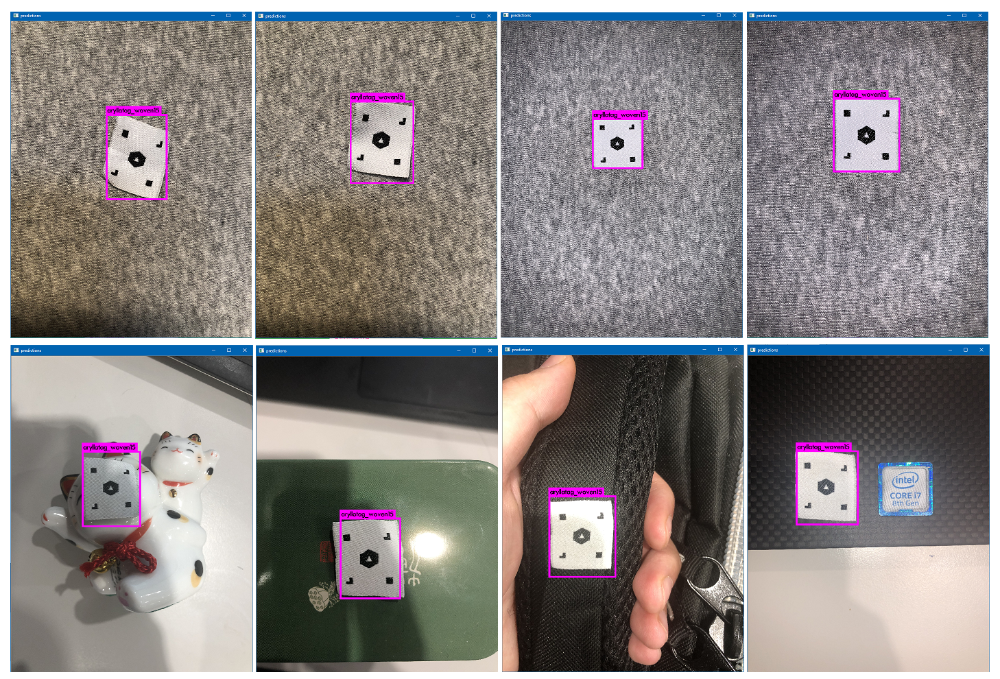

# YOLO-v3 Object Detection

After install the darknet with cuda, opencv. Run the demo using webcam:
```
darknet detector demo cfg/coco.data cfg/yolov3.cfg yolov3.weights
```
Run the demo using picture:
```
darknet detector cfg/yolov3.cfg yolov3.weights data/dog.jpg
```

### Install annotation tool
Install `LabelImg`, dependency `Python 3.x` + `Qt 5`.

### Add custom classes
Pre-define the classes in `labelImg/data/predefined_classes.txt`.

### Annotate custom data set
Generate file form:
1. PASCAL VOC: .xml (Top left, bottom right points);
2. YOLO: .txt (class_id, x, y, w, h) ratio form.

### Reform data set
Convert data files using: `datacheck/gen_anchors.py`. (PASCAL->COCO)
Augment data with annotation: `datacheck/annotation_augment.py`.
Check augmentation results: `datacheck/annotation_check.py`.

### Configrations for data & model
Modify configuration files:
1. `data/voc.name` for classes;
2. `cfg/voc.data` images & labels file;
3. `cfg/yolo3-voc.cfg` model configuration

### Configrations model
Using k-means to calculate prior bounding box anchors:
```
darknet.exe detector calc_anchors cfg/voc-at.data -num_of_clusters 9 -width 256 -height 256
```
Revise conv and yolo layers:
1. conv filters before yolo = (classes+5)*3
2. modify num of classes in yolo layer

### Train
Transfer learning: download pre-trained model named `darknet53.conv.74` (without fully connected layer);
Training:
```
darknet detector train cfg/voc-at.data cfg/yolov3-voc-at.cfg darknet53.conv.74
```

### Test
Test on video:
```
darknet detector demo cfg/voc-at.data cfg/yolov3-voc-at-test.cfg backup/yolov3-voc-at_final.weights testfiles/***.MOV
```
Test on image:
```
darknet detector test cfg/voc-at.data cfg/yolov3-voc-at-test.cfg backup/yolov3-voc-at_final.weights testfiles/***.JPG
```

### Result



